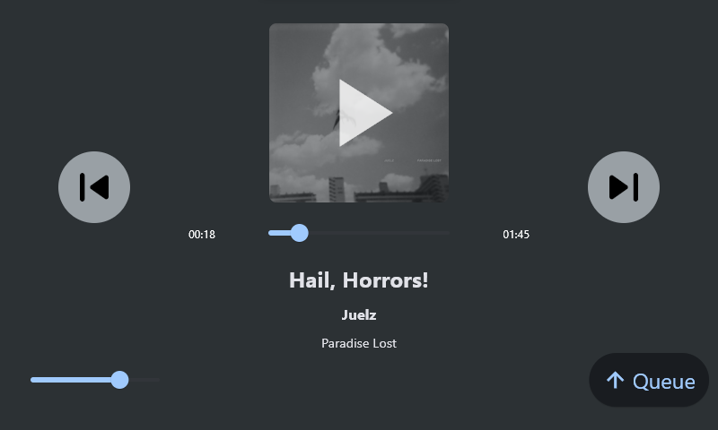
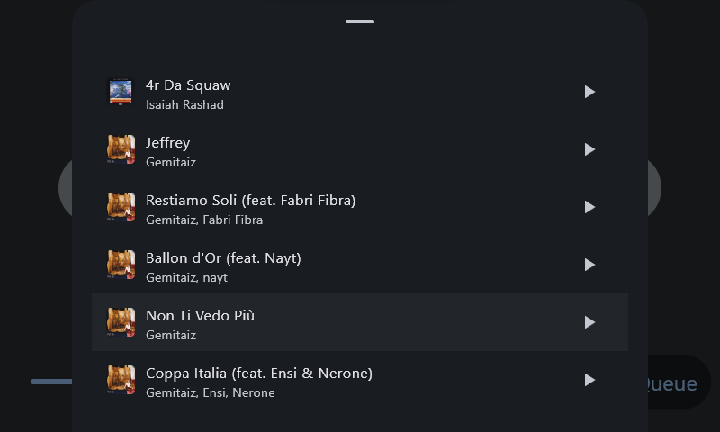

# Spot(ify) controller app

Made for 4,3' touch lcd from wondershare, ui is built for 800x480 so scaling may be a problem.

for now is just the player, controlling a single device, hardcoded, which is the string "SAMWIN", have fun with that leak.

it uses pylette to select the colors for the ui bg and iconsbg and the luminance check to change the icons color

updates the ui every 1s, if it's playing , otherwise every 5s, idk the rate limit, wasn't able to find them, so until works it is what it is.

You'll need to set spotipy variables into a credentials.py file into the src folder of the project.

this is not very secure, you should use env variables.

```
SPOTIPY_THING = "123123123"
```

## SCREENSHOT






Run the app

### uv

Run as a desktop app:

```
uv run flet run
```

Run as a web app:

```
uv run flet run --web
```

### Poetry

Install dependencies from `pyproject.toml`:

```
poetry install
```

Run as a desktop app:

```
poetry run flet run
```

Run as a web app:

```
poetry run flet run --web
```

For more details on running the app, refer to the [Getting Started Guide](https://flet.dev/docs/getting-started/).

## Build the app

### Android

```
flet build apk -v
```

For more details on building and signing `.apk` or `.aab`, refer to the [Android Packaging Guide](https://flet.dev/docs/publish/android/).

### iOS

```
flet build ipa -v
```

For more details on building and signing `.ipa`, refer to the [iOS Packaging Guide](https://flet.dev/docs/publish/ios/).

### macOS

```
flet build macos -v
```

For more details on building macOS package, refer to the [macOS Packaging Guide](https://flet.dev/docs/publish/macos/).

### Linux

```
flet build linux -v
```

For more details on building Linux package, refer to the [Linux Packaging Guide](https://flet.dev/docs/publish/linux/).

### Windows

```
flet build windows -v
```

For more details on building Windows package, refer to the [Windows Packaging Guide](https://flet.dev/docs/publish/windows/).
