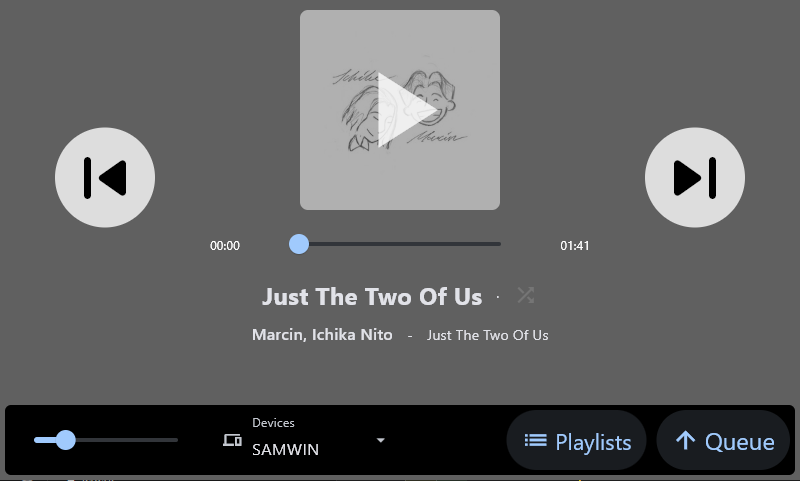
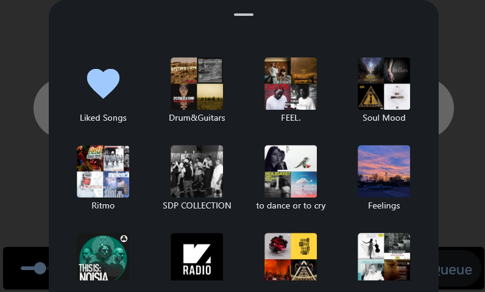
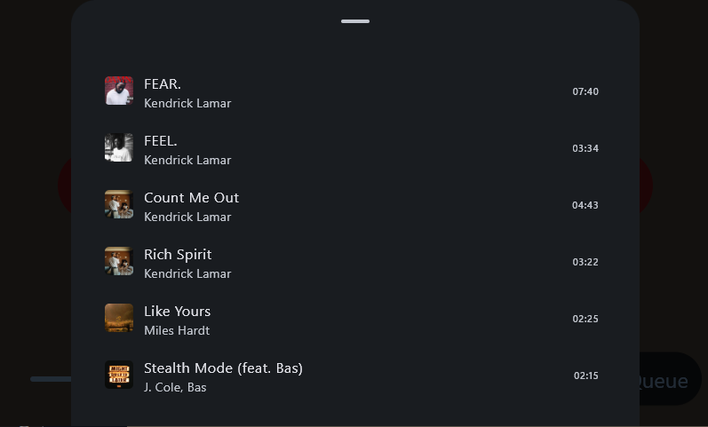

# A Desk Thing - Spotify remote controller

Simple remote controller for spotify devices, allows to control different devices and play from the saved songs/playlists.


## Update 13/7/2025:
The new Flet 2.0.0 ships with a video component which needs libmpv.so.1 installed, which isn't bt default on raspian, nor is the binary available as of now.

so u'll need to install libmpv-dev and mpv, then simlink libmpv.so from usr/lib/aarch64-linux-gnu.

```
sudo apt install libmpv-dev mpv
sudo ln -d /usr/lib/aarch64-linux-gnu/libmpv.so /usr/lib/libmpv.so.1
```
## Features:

- Saved playlists explorer
- Liked Songs explorer
- Device Selector/Switcher
- Shuffle toggle (repeat toggle soon)
- Queue list
- Slider Volume control
- Play/pause/next/previous controls
- Slider Seek Track / Progress Visualization
- Session cache (persistent session storage soon)

it does not implement search nor allows for visualization of info of any kind, it's just to allow control of the music with a simple desktop touchscreen rpi

is made for a 4,3' touch lcd from wondershare, ui is built for 800x480 and most is someway fixed, you will need to change some value to make fit bigger screens, i may fix that in the future (if flet allows to better control of textfields!)

It should be able to run on any os, but i'm not sure about mobile.

updates the state every 1s if it's playing, every 5s if idle, it should not consume lots of api calls but the rate limit isn't clear, is just based on a 30s rolling window average call/s, which should be ok on this use case.

during test i peaked at 10k combined calls in 1 day of full dev, and never got rate limited, i imagine if you start opening all the playlists you may get it, idk.ou'll need to set spotipy variables into a credentials.py file into the src folder of the project like this:

```
SPOTIPY_CLIENT_ID = "123123123"
SPOTIPY_SECRET = "123123123"
SPOTIPY_REDIRECT_URI = "123123123"

```

this is not very secure, you should use env variables.

## SCREENSHOT








### uv

Install dependencies from `pyproject.toml`:

```
uv sync
```

Run as a desktop app:

```
uv run flet run
```

Run as a web app:
it main not work this way, idk

```
uv run flet run --web
```

For more details on running the app, refer to the [Getting Started Guide](https://flet.dev/docs/getting-started/).

## Build the app

### Android

```
flet build apk -v
```

For more details on building and signing `.apk` or `.aab`, refer to the [Android Packaging Guide](https://flet.dev/docs/publish/android/).

### iOS

```
flet build ipa -v
```

For more details on building and signing `.ipa`, refer to the [iOS Packaging Guide](https://flet.dev/docs/publish/ios/).

### macOS

```
flet build macos -v
```

For more details on building macOS package, refer to the [macOS Packaging Guide](https://flet.dev/docs/publish/macos/).

### Linux

```
flet build linux -v
```

For more details on building Linux package, refer to the [Linux Packaging Guide](https://flet.dev/docs/publish/linux/).

### Windows

```
flet build windows -v
```

For more details on building Windows package, refer to the [Windows Packaging Guide](https://flet.dev/docs/publish/windows/).
